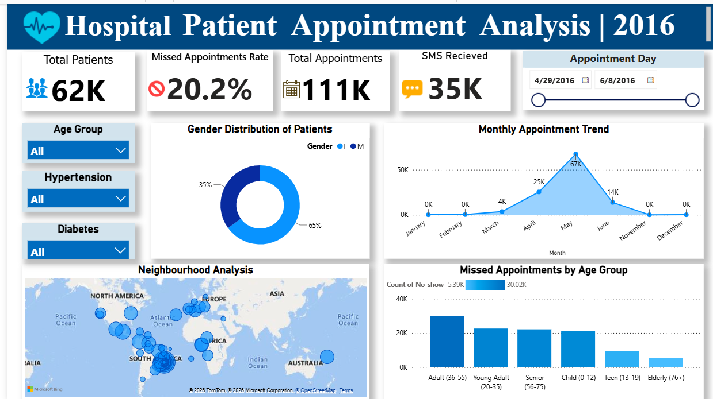

# 🏥 Hospital Patient Appointment Analysis | Power BI

## 📖 Project Overview

This project presents an interactive Power BI dashboard built to analyze hospital patient appointment data. The dashboard provides insights into appointment trends, patient demographics, missed appointment rates, and neighborhood-level analysis through interactive visualizations.

---

## 📊 Dashboard Preview

---

## 🎯 Objectives

- Analyze hospital appointment patterns.
- Monitor missed appointment (No-show) rates.
- Understand patient demographics.
- Identify trends over time.
- Support healthcare decision-making through interactive visualizations.

---

## 📈 Dashboard Features

- KPI Cards
  - Total Patients
  - Total Appointments
  - Missed Appointment Rate
  - SMS Received

- Interactive Filters
  - Appointment Date
  - Age Group
  - Hypertension
  - Diabetes

- Visualizations
  - Monthly Appointment Trend
  - Gender Distribution
  - Neighborhood Analysis (Map)
  - Missed Appointments by Age Group

---

## 📌 Key Insights

- The dataset contains over **111K hospital appointments**.
- Approximately **20.2%** of appointments resulted in no-shows.
- Female patients account for around **65%** of total appointments.
- Adults aged **36–55 years** recorded the highest number of missed appointments.
- Appointment volume reached its peak in **May**.

---

## 🛠️ Tools & Technologies

- Microsoft Power BI
- Power Query
- DAX
- Microsoft Excel / CSV
- Data Visualization

---

## 📂 Project Files

- Hospital Patient Appointment Analysis.pbix
- healthcare_dataset.csv
- Dashboard.png
- README.md

---

## 🚀 Skills Demonstrated

- Data Cleaning
- Data Transformation
- Data Modeling
- DAX Calculations
- Interactive Dashboard Design
- KPI Development
- Business Intelligence Reporting

---

## 👤 Author

**Bisma M B**

Aspiring Data Analyst | Power BI | SQL | Excel | Python
